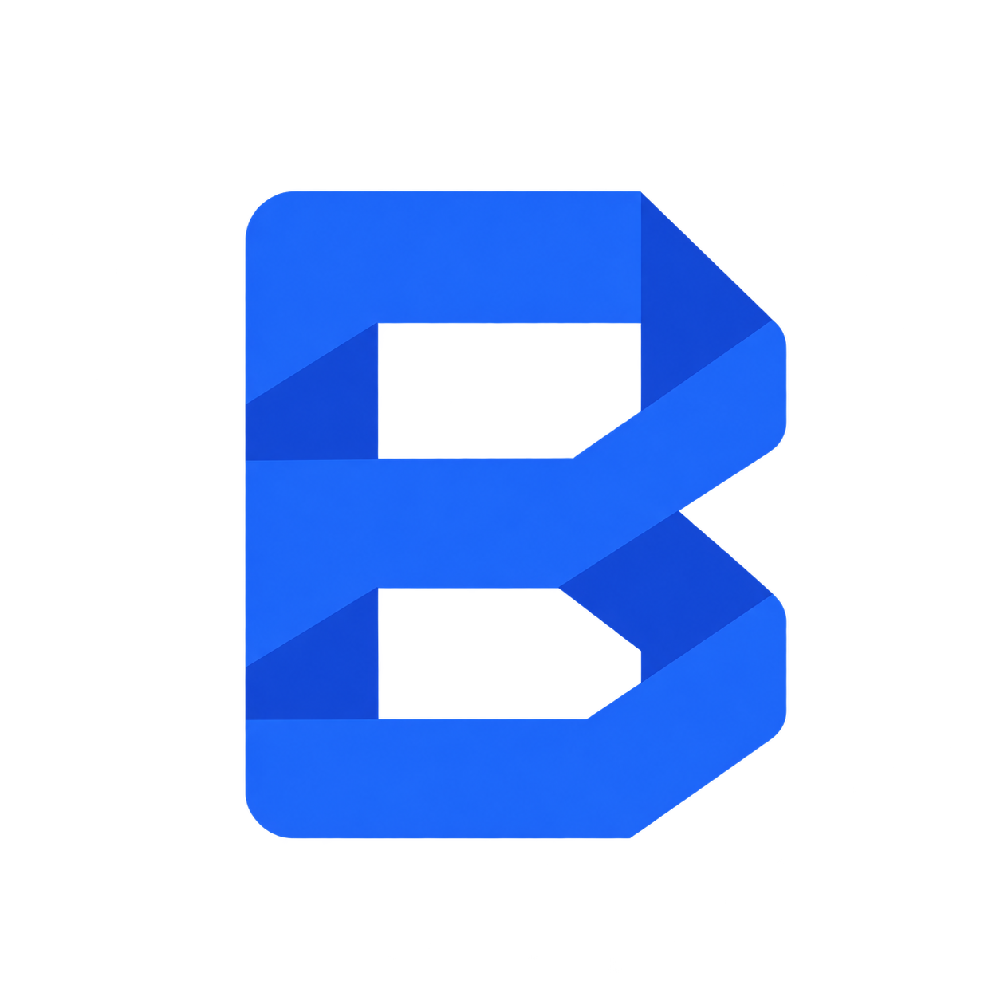

<div align="center">


# Browser

**An AI-driven, sidebar-first browser.**

<a href="LICENSE"></a>


Open source · Bring your own AI · Everything runs on your machine

</div>

Browser is a Chromium browser built around two ideas: **the sidebar is the
interface**, and **AI agents are first-class citizens**, not a bolted-on chat
box. It is a product by Jawaid Gadiwala, based on
[BrowserOS](https://github.com/browseros-ai/BrowserOS).

## What Browser is

- **Sidebar-first UX.** A side panel docked on the left with no header, hidden
  tab strip, apps (essentials), spaces with per-space theme, folders, pinned
  tabs, today tabs, archive, compact mode with hover reveal, glance overlay, and
  smooth swiping between spaces. The window is the page; everything else lives
  in the sidebar.
- **Agents as first-class.** Claude Code and other agents work inside the
  browser chat and from your terminal, driving the browser you are already
  logged into over MCP. A cockpit shows what agents are doing, with session
  replay, an audit trail, and tab isolation. Agents get their own tab groups and
  cannot touch yours.
- **Bring your own AI.** Use your own provider keys, or connect a coding agent
  you already pay for (Claude Code, Codex). There is no dependency on any hosted
  model service, and no account to create.
- **Chromium under the hood.** Chrome extensions, DevTools/CDP, tab groups, and
  the side panel all work, because this is Chromium (151.x) with a small set of
  feature-gated native patches.

## Status

Early, usable daily, and moving fast.

| Area | State |
| --- | --- |
| macOS (Apple Silicon) | primary target; daily driver |
| Windows, Linux | planned; build lanes next |
| Sidebar, spaces, essentials, folders, archive | shipped |
| Agent chat, cockpit, MCP, capture | shipped |
| Native shell patches (branding, left panel, hidden strip) | landing |
| Own update feed and signed installers | not yet — see [`updates/`](updates/) |

There are no prebuilt downloads yet. Build it from source, as below.

## Running it

Two layers, each runnable on its own: the **extension + servers** (sidebar UI,
spaces, chat, cockpit) and the **native Chromium shell**.

### Daily driver (extension + servers on a stock Chromium shell)

```bash
cd packages/browseros-agent
bun run personal:build    # build both extensions + the Rust server (release)
bun run personal:start    # launch the stack; runs until the browser quits
bun run personal:stop     # stop whatever personal:start started
```

There is also a double-clickable launcher at
`packages/browseros-agent/tools/personal/Browser.command` (and a
`Browser.app` wrapper next to it).

- Profile: `~/Library/Application Support/Browser`
- Logs: `~/Library/Logs/Browser/`
- Ports: CDP 9005, chat server 9105, extension 9305, agent server 9205

Until the native build ships, the launcher prefers `/Applications/Browser.app`,
a re-signed copy of the stock bundle created by
`packages/browseros-agent/tools/personal/make-branded-app.sh` (correct icon and
name in the Dock). Full details: [`docs/personal/daily-driver.md`](docs/personal/daily-driver.md).

### Extension development loop

```bash
cd packages/browseros-agent
bun run dev:watch:full:new
# then drive the running UI over CDP:
BROWSEROS_CDP_PORT=<port> bun scripts/dev/inspect-ui.ts targets|snapshot|click|fill|eval|screenshot <target>
```

Bun only. Run `bun run check` and `bun run test` before committing;
Rust uses `cargo fmt/clippy/test`, Go uses `go vet/test`.

### Native build (Chromium from source)

Needs a Chromium checkout at `~/chromium/src` and roughly 100 GB free. 16 GB of
RAM works, but links slowly.

```bash
cd packages/browseros
uv run browseros build --preset release --product browseros --arch arm64 \
  --provision none --no-sign --no-upload --resource-mode published \
  --chromium-src ~/chromium/src
```

Build logs land in `~/Library/Logs/Browser/chromium-build-*.log`. Native changes
are kept as named, pref-gated patches under
`packages/browseros/chromium_patches` with a registry in `.features.yaml`; the
Chromium tree is never vendored. Use `browseros extract` and
`browseros dev doctor` when working on patches. Full details:
[`docs/personal/native-build.md`](docs/personal/native-build.md).

## Architecture in one paragraph

The **shell** is Chromium patches: branding, the left-docked headerless side
panel, hidden tab strip, toolbar buttons, compact-mode hover reveal, glance
overlay, window tint, and additions to the `chrome.browserOS.*` API. Every patch
is a small, feature-gated, pref-controlled unit so rebasing onto upstream stays
cheap. The **content** is an extension plus local servers: sidebar UI, spaces
model, essentials, folders, archive, chat, capture, and cockpit, written in
React. State persists by URL and our own ids — never by Chromium tab or group
ids — with one tab group per space per window.

More: [`docs/personal/sidebar-spec.md`](docs/personal/sidebar-spec.md),
[`docs/personal/native-patches-plan.md`](docs/personal/native-patches-plan.md),
[`docs/personal/browseros-extension-architecture.md`](docs/personal/browseros-extension-architecture.md),
[`docs/personal/neo-features-usage.md`](docs/personal/neo-features-usage.md).

## Privacy

- **No telemetry.** No analytics keys, no product metrics, no crash reports
  leaving your machine.
- **No hosted model.** Nothing is proxied through a service we run. Upstream's
  hosted AI provider, CDN feeds, metrics keys, and bug reporter are theirs, not
  ours, and are disabled or replaced in this product.
- **Your keys stay local.** Provider keys and agent credentials live in your own
  profile; browsing data, history, and sessions never leave the device.
- **No account.** There is nothing to sign up for.

## License and attribution

Browser is licensed under [AGPL-3.0](LICENSE). Because AGPL-3.0 means every
distributed build ships with its source, this repository is public:
<https://github.com/jawaidgadiwala/browser>.

Browser is based on the work of others, and keeps their notices intact:

- **BrowserOS** (browseros-ai/BrowserOS), AGPL-3.0, Felafax, Inc. — the base
  this is forked from. Its original README is kept as
  [`README.BrowserOS.md`](README.BrowserOS.md).
- **Chromium**, BSD-3-Clause — the engine.
- **ungoogled-chromium** patches, BSD-3-Clause — see
  [`LICENSE.ungoogled_chromium`](LICENSE.ungoogled_chromium).

See [`NOTICE`](NOTICE) for the full attribution list and
[`LICENSE`](LICENSE) for the license text. Some behavior in the sidebar is
informed by studying other browsers (see `docs/personal/`); no code, CSS, or
assets from reference browsers are copied into this project.

Copyright &copy; 2026 Jawaid Gadiwala. Upstream portions copyright their
respective authors.

## Contributing

See [`CONTRIBUTING.md`](CONTRIBUTING.md) and [`CLA.md`](CLA.md). Commits follow
[Conventional Commits](https://www.conventionalcommits.org/).
